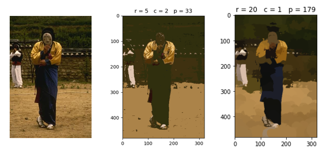

# Image Segmentation Using Mean-Shift Algorithm

This project contains an implementation of the mean-shift algorithm for image segmentation and two speedups to improve the computation 
efficiency. The implementation is structured into 4 different python scripts.

``main.py`` contains
- main function to execute the entire code
- function performing image segmentation ``image_segmentation``

``mean_shift.py``
- peak searching function ``find_peak``
- plain implementation of mean-shift procedure in function ``ms_no_speedup`` (calls ``find_peak``)
- first speedup of mean-shift algorithm in function ``ms_speedup1`` (calls ``find_peak``)
- second speedup of mean-shift algorithm in function ``ms_speedup2`` (calls ``find_peak_opt``)

``utils.py`` contains
- functions to load data and images
- functions for preprocessing of images

``plotcluster.py`` contains
- function to plot found clusters in 3D space

## Usage
In ``main.py`` set
- **source image**
- **feature type** (3D (color) features or 5D (color + spatial) features)
- **r** (radius of spherical shifting window)
- **c** (constant used for association of peaks within r/c distance of search path with converged peak)
- **filter** (applied before segmentation for image enhancement, can be none)

## Example

### Segmentation with 3D and 5D features 

Original image (left), 3D color features (middle), 5D color + spatial features (right),

with *p* equal to the number of found peaks.

Image source: https://www2.eecs.berkeley.edu/Research/Projects/CS/vision/grouping/segbench/BSDS300/html/dataset/images/color/55075.html

### Preprocessing steps and intermediate results

1. Optional enhancement with filter (none, gaussian, or median)
2. Conversion to CIELAB color space (correlates better with color changes perceived by the human eye)
3. Segmentation (result converted back to RGB color space)

Image source: https://www2.eecs.berkeley.edu/Research/Projects/CS/vision/grouping/segbench/BSDS300/html/dataset/images/color/181091.html